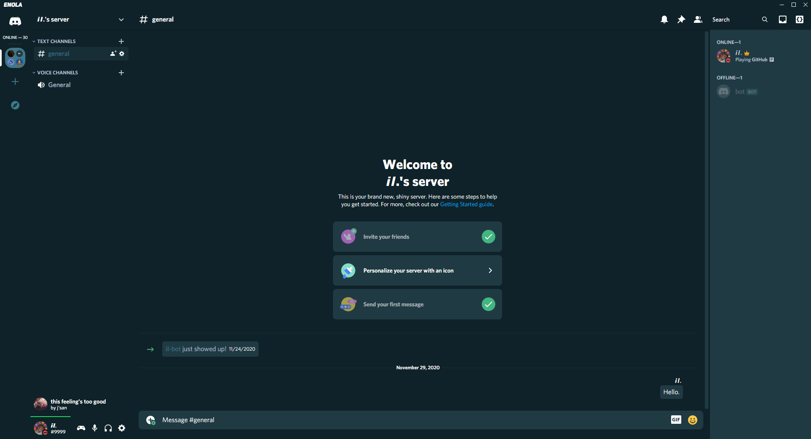

# Enola
A theme for powercord.

# How to use
Simply just clone the repo in your themes folder, /powercord/src/Powercord/themes, after that just apply it.

```
git clone https://github.com/Conjuringil/Enola.git
```

# Issues/Suggestions
If there are any issues or suggestions please dm me on discord, 𝙞𝙡.#9999, or make an issue on github.

# Images

